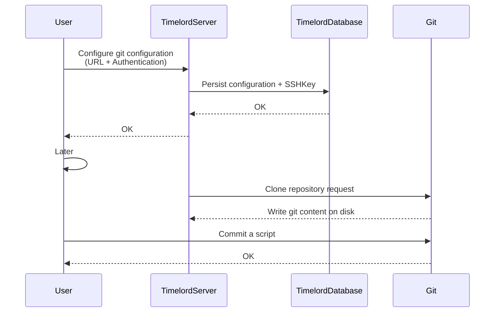
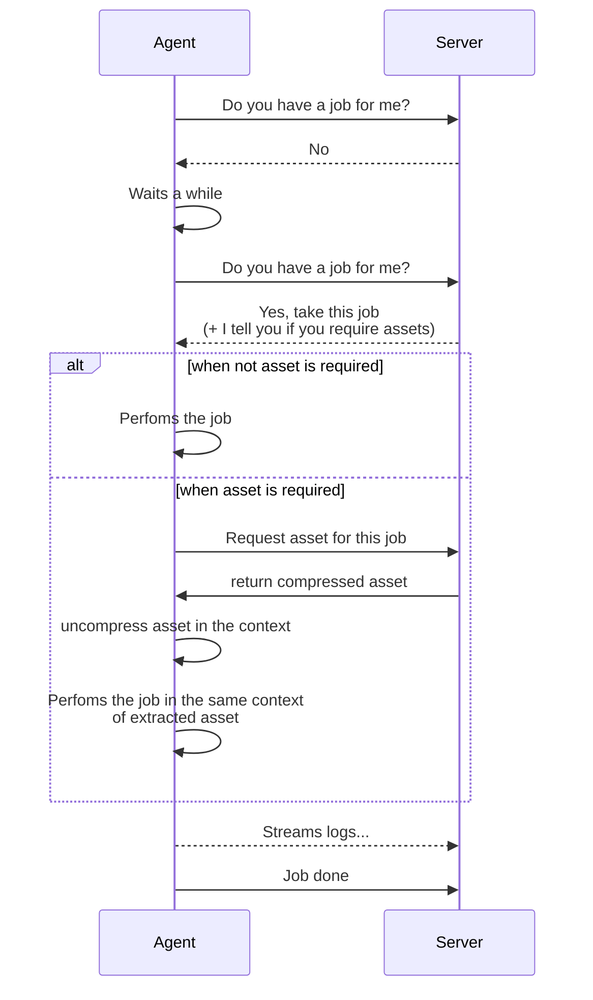

# timelord


[](#)
[](#)

## Agent installation

```bash
curl -o- -s https://raw.githubusercontent.com/Tchoupinax/timelord/refs/heads/master/scripts/timelord-agent-installation.sh \
  | bash -s -- <token> https://my.domain.com/api
```

## Table of content

[FAQ: explain me how does it work](#heading-title)
[How jobs are performed?](#heading-title)

## Overview

TimeLord is your friendly task manager that helps you run jobs and commands across multiple machines.

### What does it do?

Imagine you need to:

- Run backups on multiple servers at specific times
- Execute maintenance tasks across your infrastructure

TimeLord makes this easy! You just tell it what to do and when to do it through a nice web interface, and it takes care of executing these tasks on your behalf.

### How does it work?

1. **Central Control**: A web dashboard where you manage everything
2. **Agents**: Small programs that run on your computers and execute the tasks
3. **Secure Communication**: Everything is authenticated and encrypted
4. **Smart Scheduling**: Run tasks once, on a schedule, or based on events

It's like having a reliable assistant that makes sure all your automated tasks run smoothly across your entire infrastructure.

## Features

## Configuration

| variable               | required?                | default | comment                                                                                                       |
| ---------------------- | ------------------------ | ------- | ------------------------------------------------------------------------------------------------------------- |
| DISABLE_AUTHENTICATION | no                       | false   | If authentication is disabled, all API is opened and you have only one user because you access to everything. |
| OIDC_CLIENT_ID         | yes (if auth is enabled) |         |                                                                                                               |
| OIDC_CLIENT_SECRET     | yes (if auth is enabled) |         |                                                                                                               |
| OIDC_PROVIDER_NAME     | yes (if auth is enabled) |         |                                                                                                               |
| OIDC_PROVIDER_IMAGE    | yes (if auth is enabled) |         |                                                                                                               |

### Store password inside Vault backend

- VAULT_ADDR: `Address for Vault`
- VAULT_PATH: `{secret-engine-name}/data/{secret-name}`
- VAULT_TOKEN: `Token to access Vault API`

### How to install

[Install agent](/agent/README.md)

## FAQ: explain me how does it work

### Git configurations



### How jobs are performed?



### Alternative project

- [CronMaster](https://github.com/fccview/cronmaster)
- [IronMount](https://github.com/nicotsx/ironmount)

gerer les erreurs quand une variabled d'env n'est pas trouvée et l'afficher sur la page pour l'user
