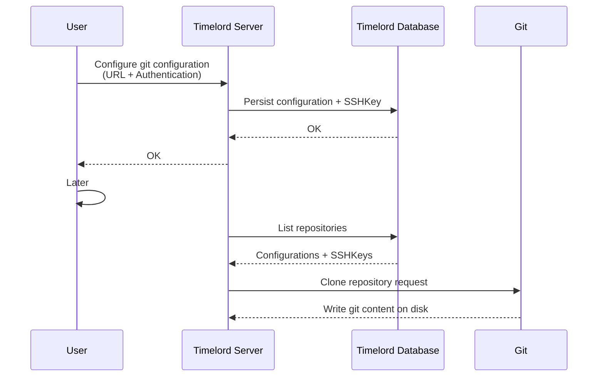
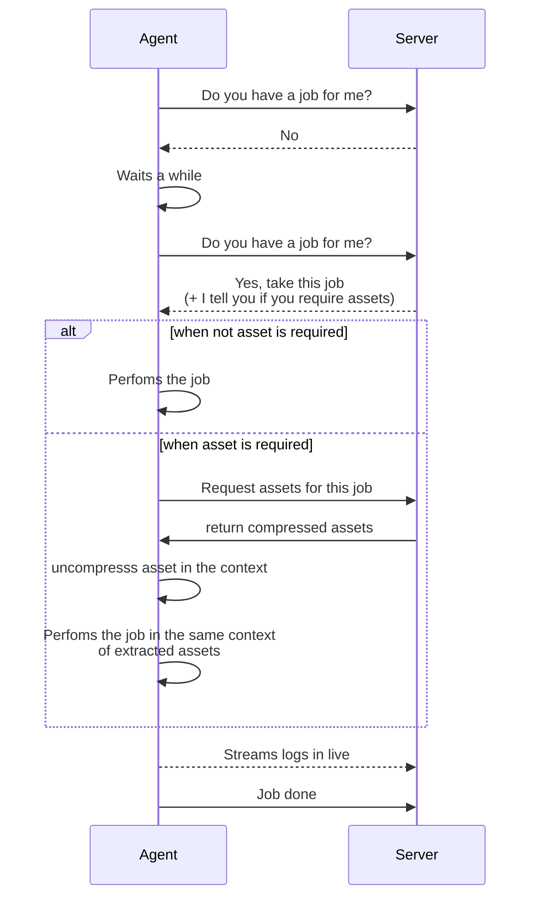

# How It Works

## Architecture Overview

TimeLord is built on a distributed architecture with three main components:

1. **Server** : The central control system that manages jobs, configurations, and agents
2. **Web application** : Web dashboard for managing everything
3. **Agent**: Lightweight program that runs on your machines and executes tasks

## Git Configuration Flow

When you configure a Git repository in TimeLord, here's how it works:

**Key Points:**
- Credentials and SSH keys are stored in the database
- The server can clone repositories on-demand

:::danger
Private keys are stored in clear in the database. We recommend to use **READ-ONLY** deploy key in this case.
:::

## Job Execution Flow

This diagram shows how jobs are executed by agents:

**Key Points:**
- Agents poll the server for available jobs. This is customizable
- Agents stream logs back to the server in real-time. You can see them in the dashboard
- Jobs can use assets directly in the same folder (like `cat myfile.txt`)
